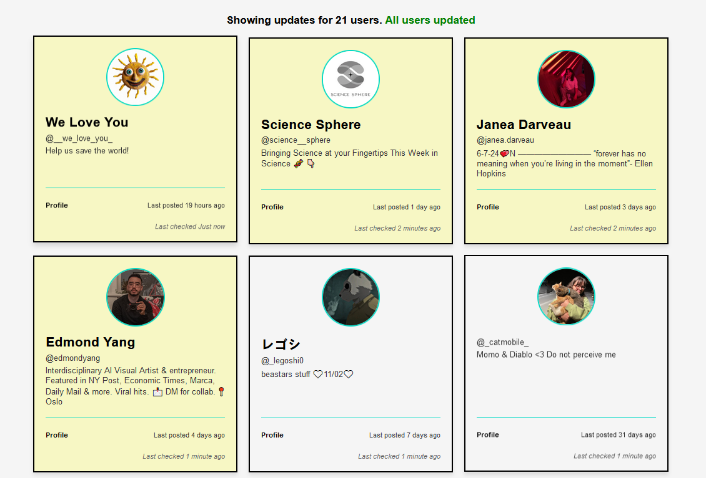

# simple-instagram

### <i>Stay up to date on friends without having to go on instagram</i>
 

 

## Description

This program scrapes the data of people you are following and displays them in a simple ui. Simply run the scraper and it will begin it's work  updating intelligently. Then run the app.py to view the data.

## Install

1. Install requirements:
`pip install -r requirements.txt`
2. Rename `.env.example` -> `.env`
3. Enter instagram username and password in .env
4. Run the scraper to collect profile data
`python scraper.py`
5. To view the data run the flask server
`python app.py`

## Why?

Simply, Instagram is shit. It blows up your home page with advertisements, people you don't follow, spam, and not enough from the people you actually care about. With this program you no longer have to scroll through mountains of garbage just to find your friends. (I'm aware the following-only tab exists but still, it's shit)

## Roadmap
- UI for selecting users to update
- Dead simple UI option
- AI summation

